# FLUX Deployment — HLD & LLD

## 1. Overview

FLUX is a cross-platform Personal Knowledge Management (PKM) application built around a shared React application, multiple runtime environments, and a Go backend.

The deployment architecture needs to support three primary ways of running FLUX:

1. **Desktop Deployment**
   - Electron application
   - Local filesystem access
   - Go backend runs as an application-scoped sidecar
   - No external deployment infrastructure is required for the user

2. **Self-Hosted Web Deployment**
   - Web frontend
   - Go backend
   - Docker-based deployment
   - User controls the infrastructure and vault data

3. **Hosted Deployment**
   - Same core web/backend architecture
   - Additional authentication, storage, and infrastructure services
   - Intended for multiple users and teams

The deployment design is built around the principle that the **application logic remains shared**, while the runtime and deployment infrastructure can change depending on the environment.

---

# 2. Deployment Goals

The deployment architecture should provide:

- Simple installation and startup
- Containerized backend services
- Docker and Podman compatibility where possible
- One-command / one-click deployment
- Clear separation between frontend and backend
- Secure communication between frontend and backend
- Persistent vault storage
- Persistent application state where required
- Health checks for deployed services
- Environment-based configuration
- Easy upgrade and rollback
- Support for both single-user and multi-user deployments
- A deployment structure that can scale from local development to production

---

# 3. Current FLUX Architecture

FLUX uses a Turborepo monorepo managed with Bun.

```text
flux/
│
├── apps/
│   ├── desktop/
│   │   └── Electron Application
│   │
│   └── web/
│       └── Vite + PWA Application
│
├── packages/
│   ├── app-core/
│   │   └── Shared React Application
│   │
│   ├── bridge-contract/
│   │   └── Runtime Interface
│   │
│   ├── client-desktop/
│   │   └── Electron IPC Implementation
│   │
│   ├── client-web/
│   │   └── HTTP Implementation
│   │
│   ├── shared-domain/
│   │   └── Domain Models
│   │
│   └── shared-ui/
│       └── Reusable UI
│
├── server/
│   └── Go Backend
│
└── docs/
    └── Deployment Documentation
```

The important deployment boundary is:

```text
                    FLUX
                      │
          ┌───────────┴───────────┐
          │                       │
     Desktop Runtime         Web Runtime
          │                       │
      Electron                 Vite/PWA
          │                       │
          └───────────┬───────────┘
                      │
               Shared app-core
                      │
              Runtime Bridge
                      │
                Go Backend
```

The deployment architecture therefore should not duplicate the product application for every environment.

Instead:

> **The product remains shared while the runtime and deployment infrastructure adapt to the environment.**

---

# 4. Deployment Architecture — HLD

## 4.1 High-Level Deployment Model

The high-level deployment architecture separates:

- Client layer
- Application layer
- Backend layer
- Data layer
- Infrastructure layer

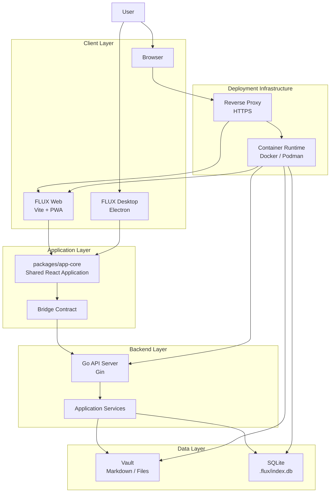

### HLD Explanation

The user interacts with FLUX through either the desktop application or the web application.

The desktop application uses Electron as its runtime shell, while the web application runs through Vite/PWA in the browser.

Both environments use the same `packages/app-core` application logic.

For web deployments, requests are sent through a reverse proxy and then forwarded to the appropriate frontend/backend service.

The Go backend is responsible for server-side operations such as:

- Vault access
- File operations
- API requests
- Database operations
- Runtime status
- Backend services

The vault remains the canonical source of user knowledge.

The `.flux/index.db` database contains derived state rather than replacing the actual files.

---

# 5. Deployment Modes

FLUX supports multiple deployment modes.

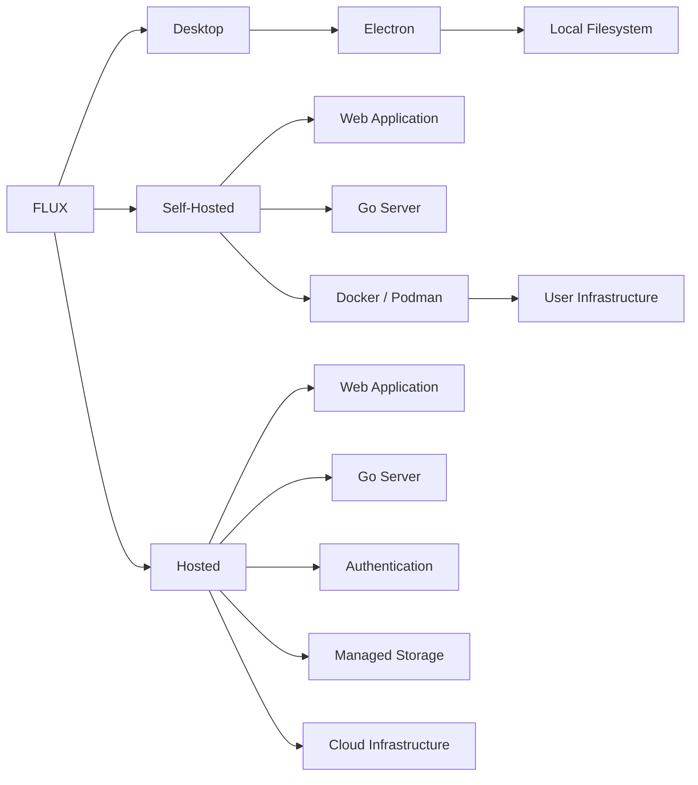

## 5.1 Desktop

The desktop deployment packages the Electron shell together with the application and backend sidecar.

```text
User
  │
  ▼
Electron Application
  │
  ├── React Renderer
  │
  ├── Preload / IPC
  │
  └── Go Sidecar
          │
          ▼
      Local Vault
```

The desktop application does not require Docker.

---

## 5.2 Self-Hosted

Self-hosted deployment is intended for users who want to run FLUX on their own infrastructure.

```text
Internet / LAN
      │
      ▼
Reverse Proxy
      │
      ├──────────────► Web Frontend
      │
      └──────────────► Go Backend
                              │
                    ┌─────────┴─────────┐
                    ▼                   ▼
                 Vault              SQLite
```

Docker Compose provides a simple way to start the required services.

Podman can be used as an alternative container runtime where the Compose configuration remains compatible.

---

## 5.3 Hosted

Hosted deployment extends the self-hosted model with managed infrastructure.

```text
User
 │
 ▼
HTTPS
 │
 ▼
Load Balancer
 │
 ├──────────────► Web Application
 │
 └──────────────► Backend
                       │
             ┌─────────┼─────────┐
             ▼         ▼         ▼
           Auth      Storage    Database
```

The hosted environment is designed to support multiple users and potentially team-based access.

---

# 6. Containerization HLD

The self-hosted deployment should package the web and backend components into deployable containers.

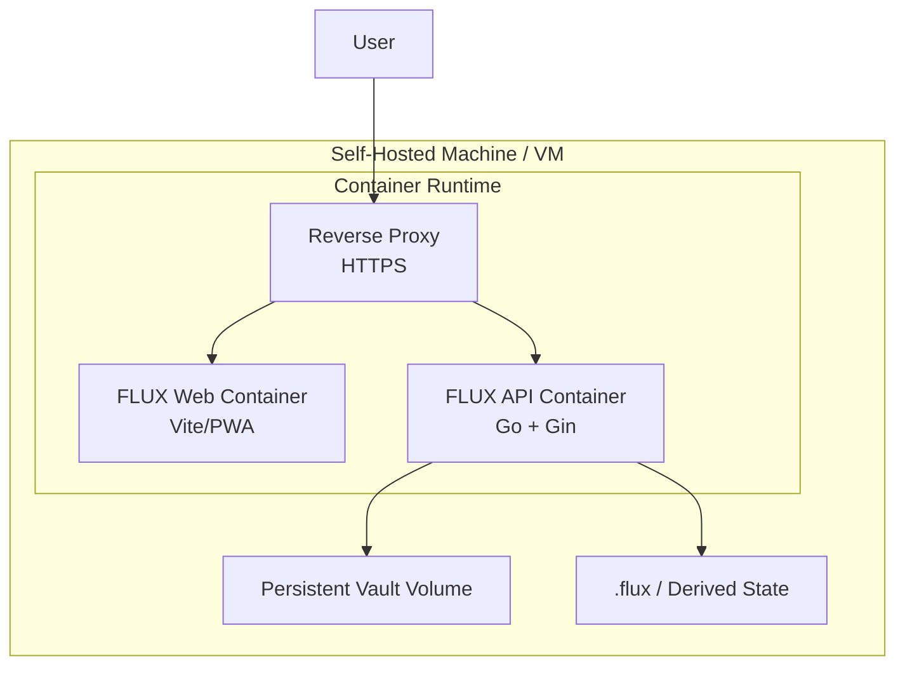

## Container Responsibilities

### Web Container

Responsible for:

- Serving the FLUX web application
- Serving static frontend assets
- Connecting the browser to the backend
- PWA functionality where applicable

### API Container

Responsible for:

- Go backend
- HTTP API
- Vault access
- File operations
- SQLite access
- Backend services

### Reverse Proxy

Responsible for:

- HTTPS termination
- Routing
- Request forwarding
- Security headers
- Optional rate limiting

---

# 7. Container Communication

The containers should communicate over an internal container network.

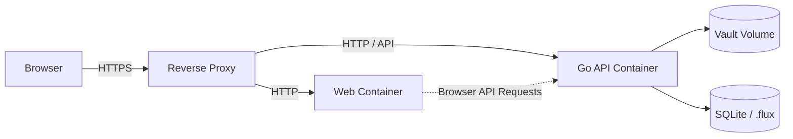

The database and vault should not be directly exposed to the public network.

Only the required HTTP/HTTPS endpoints should be exposed.

---

# 8. Docker Compose HLD

A self-hosted deployment can be represented by a Compose stack.

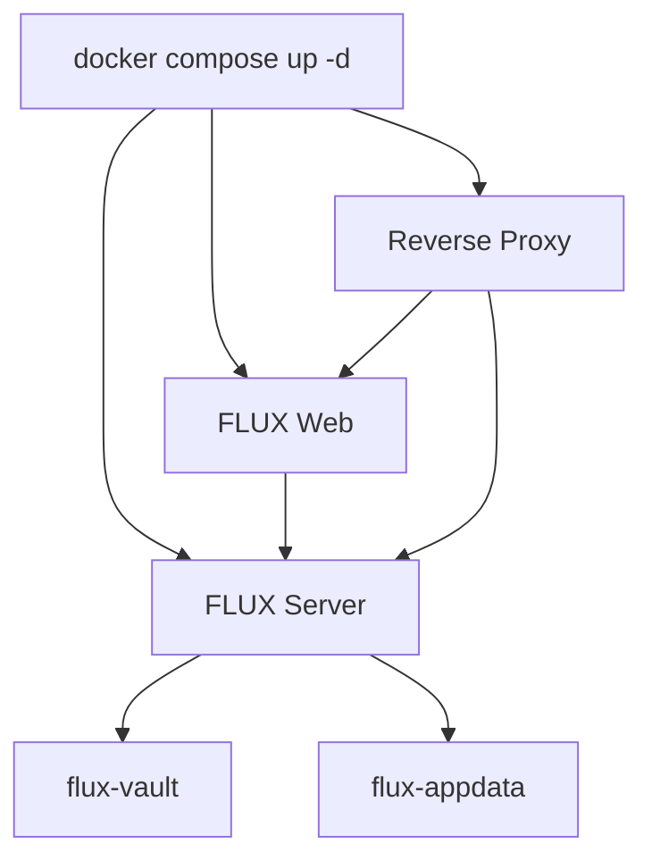

The deployment command:

```bash
docker compose up -d
```

starts the required services in the correct dependency environment.

---

# 9. One-Click Deployment

## 9.1 Goal

The purpose of one-click deployment is to reduce deployment complexity for users.

Instead of requiring users to manually:

1. Install dependencies
2. Configure services
3. Build the frontend
4. Build the backend
5. Create networks
6. Create volumes
7. Start containers

the deployment process should perform these operations automatically.

---

## 9.2 One-Click Deployment Flow

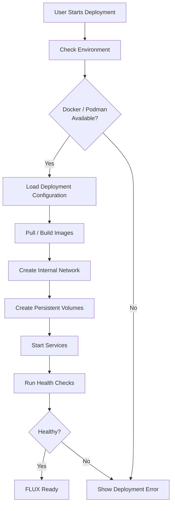

---

# 10. One-Click Deployment Implementation

A deployment wrapper can be provided around the Compose configuration.

For example:

```bash
./deploy.sh
```

The script can:

```text
1. Check Docker
2. If Docker is unavailable, check Podman
3. Validate environment configuration
4. Create required directories
5. Create persistent volumes
6. Start the Compose stack
7. Wait for health checks
8. Print the application URL
```

Example:

```bash
#!/bin/sh

set -e

echo "Checking container runtime..."

if command -v docker >/dev/null 2>&1; then
    RUNTIME="docker"
elif command -v podman >/dev/null 2>&1; then
    RUNTIME="podman"
else
    echo "Docker or Podman is required."
    exit 1
fi

echo "Using: $RUNTIME"

$RUNTIME compose up -d

echo "Waiting for FLUX services..."

$RUNTIME compose ps

echo "FLUX deployment started."
```

The exact script should be adapted to the final production Compose configuration.

---

# 11. Docker vs Podman

The deployment architecture should avoid unnecessary dependency on a single container engine.

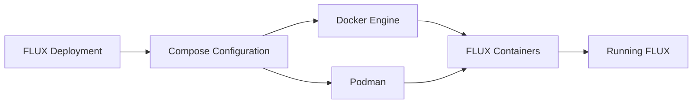

## Docker

Docker is the primary container runtime currently documented for FLUX.

Typical command:

```bash
docker compose up -d
```

## Podman

Podman provides a daemonless container runtime and can be used where the Compose configuration and required features are compatible.

Typical command:

```bash
podman compose up -d
```

The deployment configuration should therefore avoid unnecessary Docker-specific assumptions where possible.

---

# 12. Deployment LLD

The Low-Level Design describes the actual deployment components and their responsibilities.

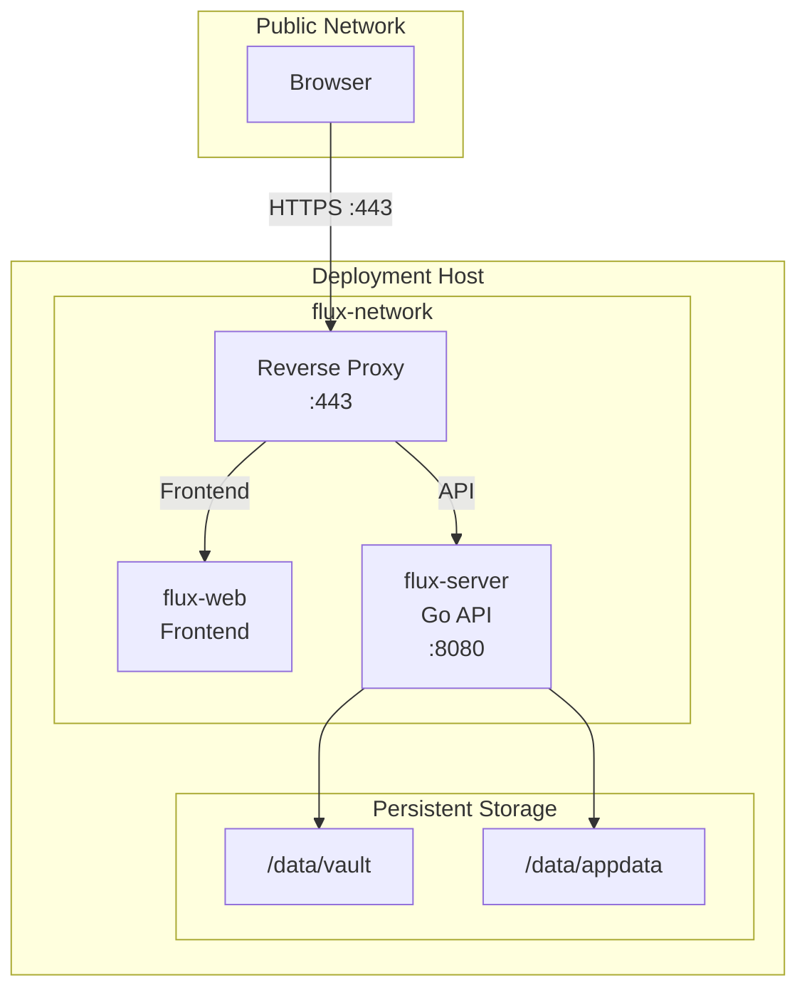

---

# 13. LLD — Web Container

The web container packages the built Vite application.

```text
Source
  │
  ▼
apps/web
  │
  ▼
Vite Build
  │
  ▼
dist/
  │
  ▼
Web Container
  │
  ▼
Static Assets
  │
  ▼
Browser
```

Example conceptual Dockerfile:

```dockerfile
FROM node:22-alpine AS build

WORKDIR /app

COPY package.json bun.lock ./
RUN corepack enable

COPY . .

RUN bun install
RUN bun run build --filter=@flux/web


FROM nginx:alpine

COPY --from=build /app/apps/web/dist /usr/share/nginx/html

EXPOSE 80
```

The exact Dockerfile should follow the repository's actual build requirements.

---

# 14. LLD — Backend Container

The Go backend is compiled into a production binary.

```text
server/
   │
   ├── Go Source
   │
   ├── API
   │
   ├── Handlers
   │
   ├── Services
   │
   ├── Database
   │
   └── Config
        │
        ▼
    Go Build
        │
        ▼
   FLUX Server Binary
        │
        ▼
   Backend Container
```

Example conceptual Dockerfile:

```dockerfile
FROM golang:1.25 AS build

WORKDIR /src

COPY go.mod go.sum ./
RUN go mod download

COPY . .

RUN go build -o flux-server .


FROM alpine:latest

WORKDIR /app

COPY --from=build /src/flux-server /app/flux-server

EXPOSE 8080

CMD ["/app/flux-server"]
```

The production image should eventually use a minimal runtime image and follow the project's final Go build structure.

---

# 15. LLD — Persistent Storage

The vault is the most important persistent resource.

The container must not treat the vault as temporary container storage.

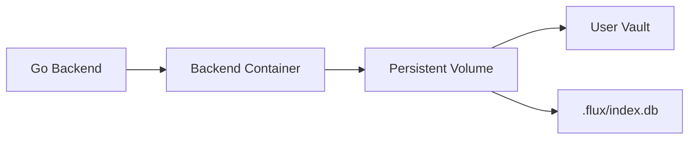

The important principle is:

> Containers can be replaced. User data must survive container replacement.

Therefore:

- Vault files must be persistent.
- `.flux/index.db` should be persistent or safely rebuildable.
- Container deletion must not delete the user's vault.
- Backup strategy should focus primarily on the canonical vault data.

---

# 16. LLD — Environment Configuration

Deployment-specific values should be supplied through environment variables rather than hard-coded into the application.

Example:

```env
FLUX_VAULT_PATH=/data/vault

FLUX_SERVER_PORT=8080

FLUX_ENV=production

FLUX_LOG_LEVEL=info
```

For hosted deployments, additional configuration may include:

```env
AUTH_ENABLED=true

DATABASE_URL=...

STORAGE_PROVIDER=...

PUBLIC_URL=https://example.com
```

Secrets should never be committed directly into Git.

Use:

- Environment variables
- Secret managers
- Container secrets
- Platform-specific secret storage

depending on the deployment environment.

---

# 17. LLD — Health Checks

Every production service should expose a way to determine whether it is healthy.

FLUX already provides:

```text
GET /health
```

This can be used by the deployment system.

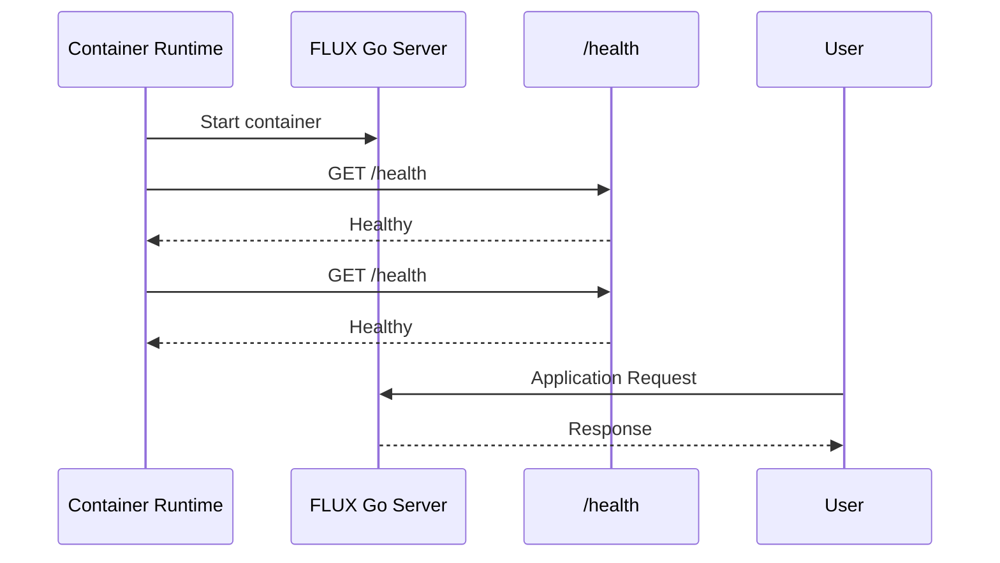

If the health check fails repeatedly, the deployment system should mark the service as unhealthy.

---

# 18. LLD — Startup Sequence

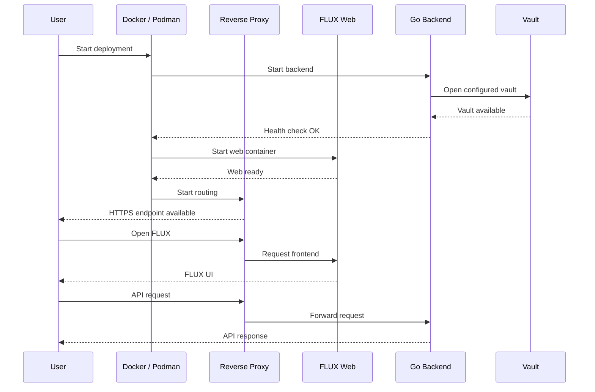

---

# 19. Request Flow

A typical web request follows this path:

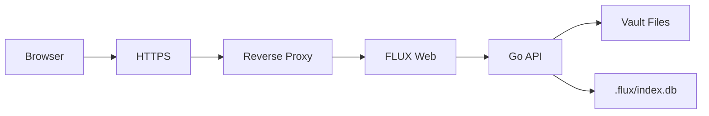

### Example

When a user opens a file:

```text
Browser
   │
   ▼
HTTPS
   │
   ▼
Reverse Proxy
   │
   ▼
Go API
   │
   ▼
Vault Filesystem
   │
   ▼
Markdown File
   │
   ▼
Go API
   │
   ▼
Browser
```

---

# 20. Security Boundary

The deployment architecture should maintain a clear security boundary.

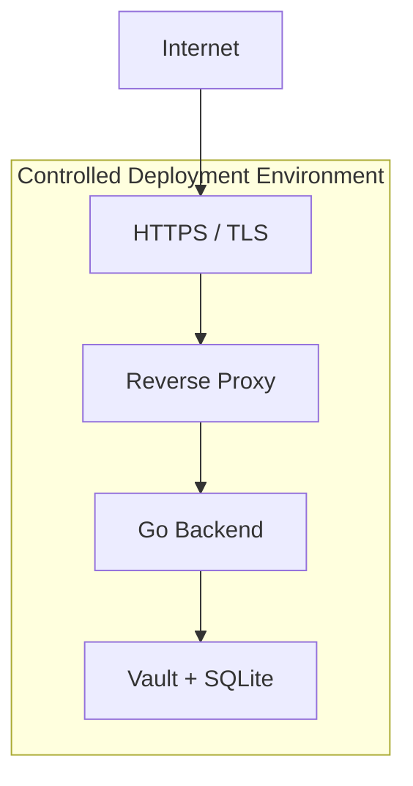

The database and filesystem should never be directly exposed to the public internet.

Only the required application endpoints should be accessible.

---

# 21. Single-User Deployment

The single-user deployment model is simpler.

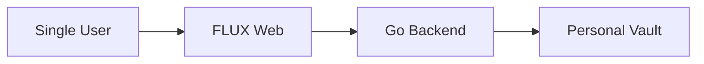

In this model:

- One user owns the deployment.
- The vault belongs to that user.
- Complex team permissions may not be required.
- Authentication can still be enabled for remote deployments.
- The deployment can run on a personal server or local machine.

---

# 22. Team Deployment

A team deployment requires an additional identity and authorization layer.

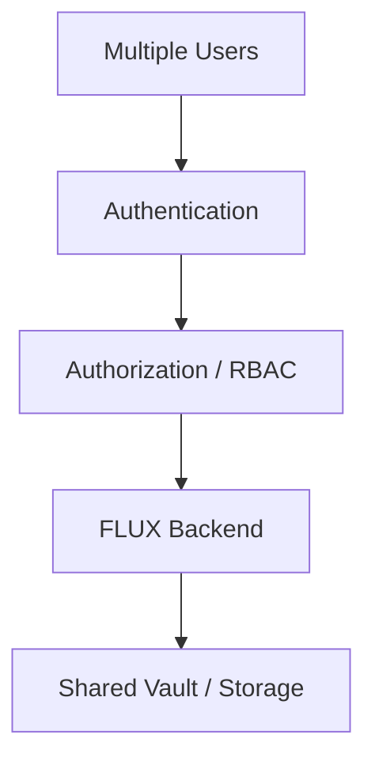

The important distinction is:

```text
Authentication
    ↓
Who are you?

Authorization
    ↓
What are you allowed to do?
```

The deployment architecture should therefore keep identity and access control separate from the basic container orchestration layer.

---

# 23. Deployment Security Requirements

A production deployment should consider:

### Transport Security

- HTTPS should be used for production web deployments.
- HTTP should not be used for transmitting authentication credentials or sensitive data over untrusted networks.
- TLS termination can occur at the reverse proxy or load balancer.

### Container Security

Containers should:

- Run with the minimum required privileges.
- Avoid unnecessary host filesystem access.
- Avoid privileged mode unless required.
- Use minimal production images.
- Keep dependencies updated.

### Secret Management

Secrets should not be:

- Hard-coded in source code.
- Committed to Git.
- Included in Docker images.

### Data Security

The deployment must protect:

- Vault files
- Authentication credentials
- Session information
- Configuration
- Database state

---

# 24. Deployment Lifecycle

The deployment lifecycle should follow:

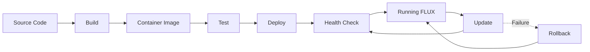

---

# 25. CI/CD Deployment Flow

A future production deployment can use the following pipeline:

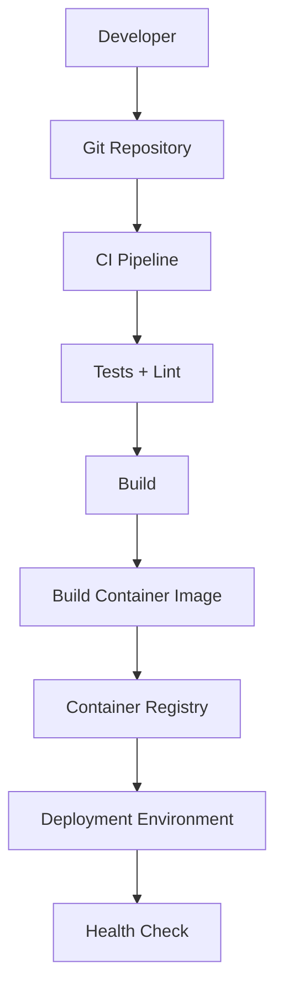

The pipeline ensures that deployment is based on a known version of the application rather than manually copied files.

---

# 26. Deployment Directory Structure

A possible deployment-related structure is:

```text
flux/
│
├── apps/
│   ├── desktop/
│   └── web/
│
├── packages/
│
├── server/
│   ├── Dockerfile
│   ├── docker-compose.yml
│   └── ...
│
├── deploy/
│   ├── docker/
│   │   ├── Dockerfile.web
│   │   └── Dockerfile.server
│   │
│   ├── compose/
│   │   ├── docker-compose.yml
│   │   └── .env.example
│   │
│   ├── scripts/
│   │   └── deploy.sh
│   │
│   └── README.md
│
└── docs/
    └── flux-deployment-hld-lld.md
```

The exact directory structure can be adjusted to match the existing repository conventions.

---

# 27. Deployment Components and Responsibilities

| Component | Responsibility |
|---|---|
| Electron | Desktop runtime |
| Vite/PWA | Web application |
| app-core | Shared product UI/application logic |
| Go/Gin | Backend API |
| SQLite | Derived application state |
| Vault | Canonical user data |
| Docker | Container runtime |
| Podman | Alternative container runtime |
| Compose | Multi-container orchestration |
| Reverse Proxy | HTTPS and request routing |
| Health Endpoint | Service health detection |
| Persistent Volume | Data persistence |
| CI/CD | Automated build and deployment |

---

# 28. Current State vs Target State

It is important to distinguish what already exists from what is being designed.

## Current State

FLUX currently provides:

- Electron desktop application
- Vite/PWA web application
- Go backend
- Docker-based backend deployment
- Docker Compose deployment
- SQLite derived state
- Filesystem-based vault
- `/health` endpoint
- Web API endpoints
- Separate web and desktop runtime adapters

## Target Deployment Improvements

The deployment work should extend this architecture toward:

- Standardized container images
- Complete web + backend Compose deployment
- Docker and Podman compatibility
- One-command deployment
- One-click deployment experience
- Production HTTPS configuration
- Health checks
- Persistent volume configuration
- Environment-based configuration
- Secure secret handling
- Single-user deployment model
- Team deployment model
- RBAC integration
- Deployment documentation
- CI/CD-ready container workflow

---

# 29. Recommended Deployment Flow

The final deployment experience should aim to look like:

```text
                    User
                      │
                      ▼
             Choose Deployment
                      │
          ┌───────────┴───────────┐
          │                       │
      Single User              Team
          │                       │
          ▼                       ▼
     Self Hosted              Hosted
          │                       │
          ▼                       ▼
   Docker / Podman          Cloud Infrastructure
          │                       │
          └───────────┬───────────┘
                      ▼
                FLUX Web
                      │
                      ▼
                 Go Backend
                      │
             ┌────────┴────────┐
             ▼                 ▼
          Vault              SQLite
```

---

# 30. Final Deployment Architecture

The overall deployment architecture can be summarized as:

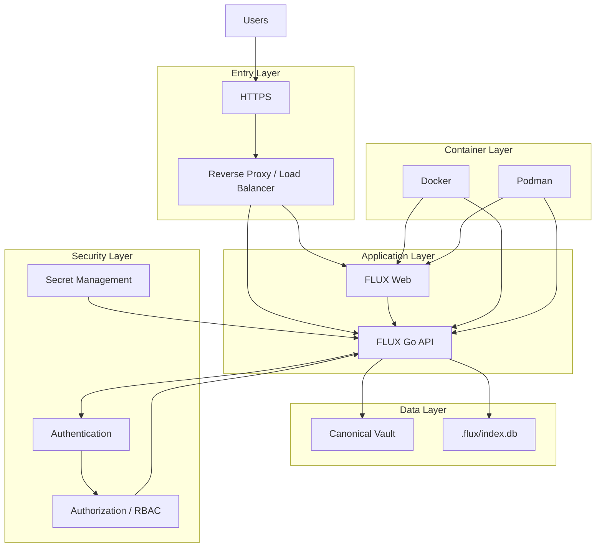

---

# 31. Key Design Principles

### 1. Containers are replaceable

Application containers should be treated as disposable runtime units.

User data must live outside the container filesystem.

### 2. The vault is the source of truth

The Markdown/filesystem vault remains the canonical source of user knowledge.

The database is derived state.

### 3. Runtime and application are separated

The shared `app-core` should not contain unnecessary deployment-specific logic.

### 4. Public access is limited

Only the required HTTP/HTTPS endpoints should be exposed.

### 5. Deployment should be reproducible

A deployment should be recreated from:

- Container images
- Compose configuration
- Environment configuration
- Persistent data

rather than manual server modifications.

### 6. Single-user and team deployments should be distinguishable

Single-user deployments can use a simpler authorization model.

Team deployments require identity, roles, permissions, and access control.

### 7. Docker and Podman should be considered at the container-runtime boundary

The deployment definition should remain as portable as practical.

---

# 32. Implementation Checklist

## Containerization

- [ ] Create production Dockerfile for web
- [ ] Create production Dockerfile for Go backend
- [ ] Define Compose configuration
- [ ] Define internal network
- [ ] Define persistent volumes
- [ ] Add health checks
- [ ] Verify container startup order
- [ ] Verify container restart behavior

## One-Click Deployment

- [ ] Create deployment script
- [ ] Detect Docker / Podman
- [ ] Validate configuration
- [ ] Create required storage
- [ ] Start containers
- [ ] Wait for health checks
- [ ] Print deployment URL
- [ ] Provide failure diagnostics

## Security

- [ ] HTTPS
- [ ] Secure headers
- [ ] Secret management
- [ ] Container privilege restrictions
- [ ] Restricted filesystem access
- [ ] Authentication
- [ ] RBAC for team deployments

## Data

- [ ] Persistent vault storage
- [ ] Persistent `.flux` state where required
- [ ] Backup strategy
- [ ] Restore strategy
- [ ] Data migration strategy

## CI/CD

- [ ] Automated tests
- [ ] Container image build
- [ ] Image tagging
- [ ] Registry publishing
- [ ] Deployment automation
- [ ] Health verification
- [ ] Rollback strategy

---

# 33. Conclusion

FLUX's deployment architecture separates the shared application from the runtime and infrastructure used to execute it.

The desktop application uses Electron, while web deployments use the Vite/PWA application together with the Go backend.

For self-hosted deployments, Docker/Podman and Compose provide the containerization layer. Persistent volumes protect the user's vault and derived state from container replacement.

The deployment architecture can then evolve from a simple single-user self-hosted setup into a production hosted environment with HTTPS, authentication, RBAC, managed storage, and automated CI/CD.

The central deployment principle is:

> **Deploy the application as replaceable services while keeping user data persistent, protected, and independent from the container lifecycle.**